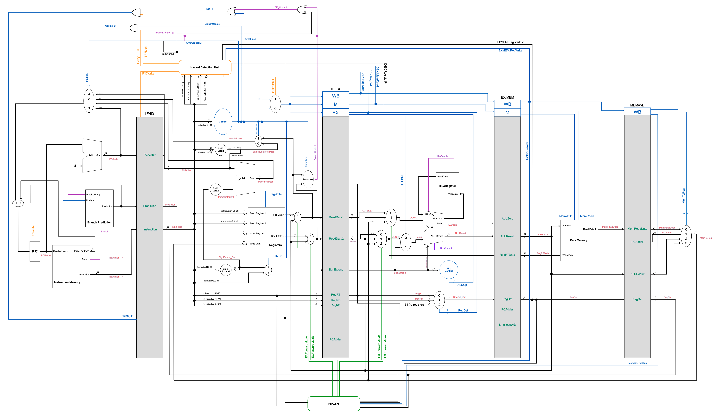

# MIPS Processor

A five-stage pipelined 32-bit MIPS core written in Verilog

Created with the goal of implementing a video compression algorithm

## Overview

## Features

- 32-bit MIPS ISA CPU core.
- Branch prediction
- Branches/jumps execute in the ID stage.
- Forwarding to ID/EX from EX/MEM
- Hazard detection

## Execution 

Core designed and synthesized in Vivado. Implemented on the Xilinx Artix-7 FPGA

## Authors

- Jake Summerville
- Diego Moscoso
- Fausto Sanchez

